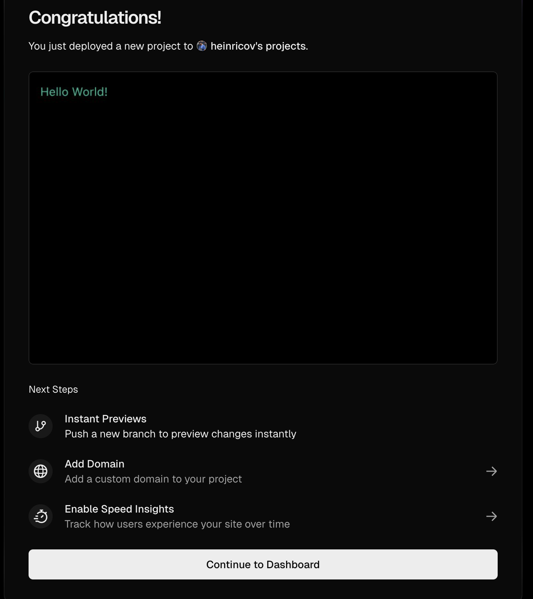

1. Setup project
   pastikan sudah menginstal nestjs cli, jika belum install dengan perintah berikut:

```bash
npm install -g @nestjs/cli
```

```bash
nest new project-name
```

2. Install dependencies

```bash
cd project-name
npm install dotenv
```

3. buat file `.env` di root project

```bash
touch .env
```

4. isi file `.env` dengan variabel environment yang dibutuhkan, misalnya anda bisa lihat di dalama file [.env](.env)

5. perbaharui file `main.ts` dengan menggunakan variabel environment seperti yang ada didalam file [src/main.ts](src/main.ts)

6. buat file `vercel.json` di root project, isi dengan konfigurasi seperti yang ada didalam file [vercel.json](vercel.json)

```bash
touch vercel.json
```

8. push project ke repository github
9. Masuk ke Vercel Dashboard dan klik "New Project"
10. Impor repositori tersebut.
11. copy semua isi yang ada di file `.env` .
12. Masukkan Environment Variables lalu pastekan isi file `.env` ke dalam field "Value".
13. Klik Deploy.
14. jika berhasil, akan muncul seperti ini.
    
